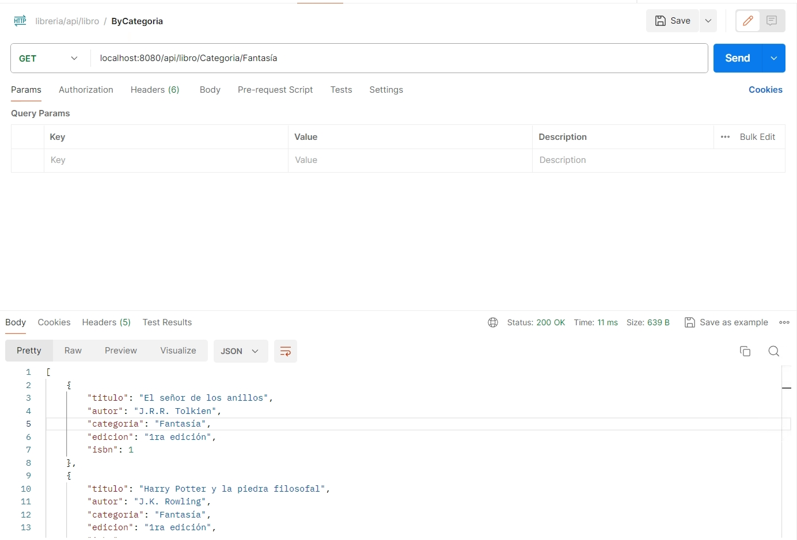
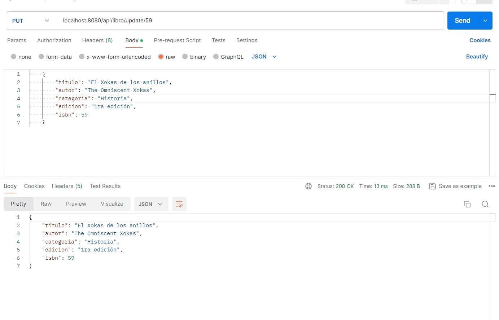
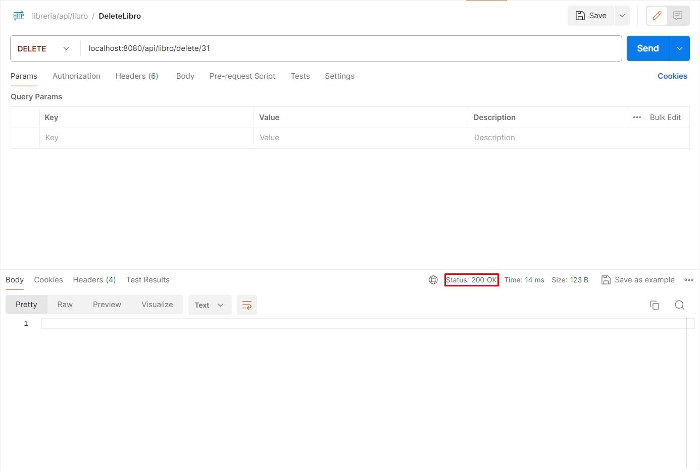

# Reto5_AD_1
Creation of an API REST Using Springboot

# Consulta para ver todos los libros

# Consulta para ver los libros con el Autor seleccionado

# Consulta para ver los libros de la Categoria seleccionada

# Consulta para añadir un libro

# Consulta para actualizar un libro, cuando esto se realize, se devolverá una consulta con los datos de el libro creado

# Consulta para eliminar un libro, como se puede observar en la imagen, te devuelve el estado de consulta OK si es correcto y un estado NOT_FOUND si no encuentra nada

